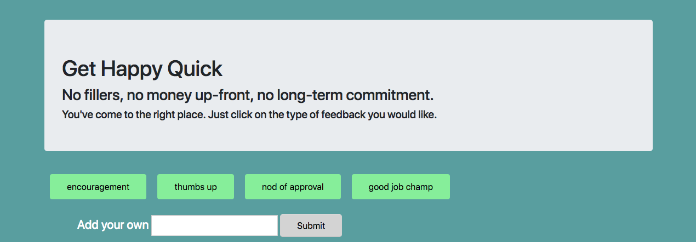

Giphy API

This application allows the user to click on topic buttons to populate gifs to the page. The user is also able to add his or her own topics, which appear as buttons along with the default ones.

Technologies used: HTML/CSS, Bootstrap, JavaScript, JQuery, AJAX through the Giphy API

Challenges I faced:

1. This was a rather smooth-sailing assignment for me since I enjoy working with APIs. I find that when there is well-defined criteria, I am simply able to declare my needs from the API through an ajax call. From there, it's just about communicating the results to the front-end. 

[Use the application](https://falondarville.github.io/giphyAPI/)
